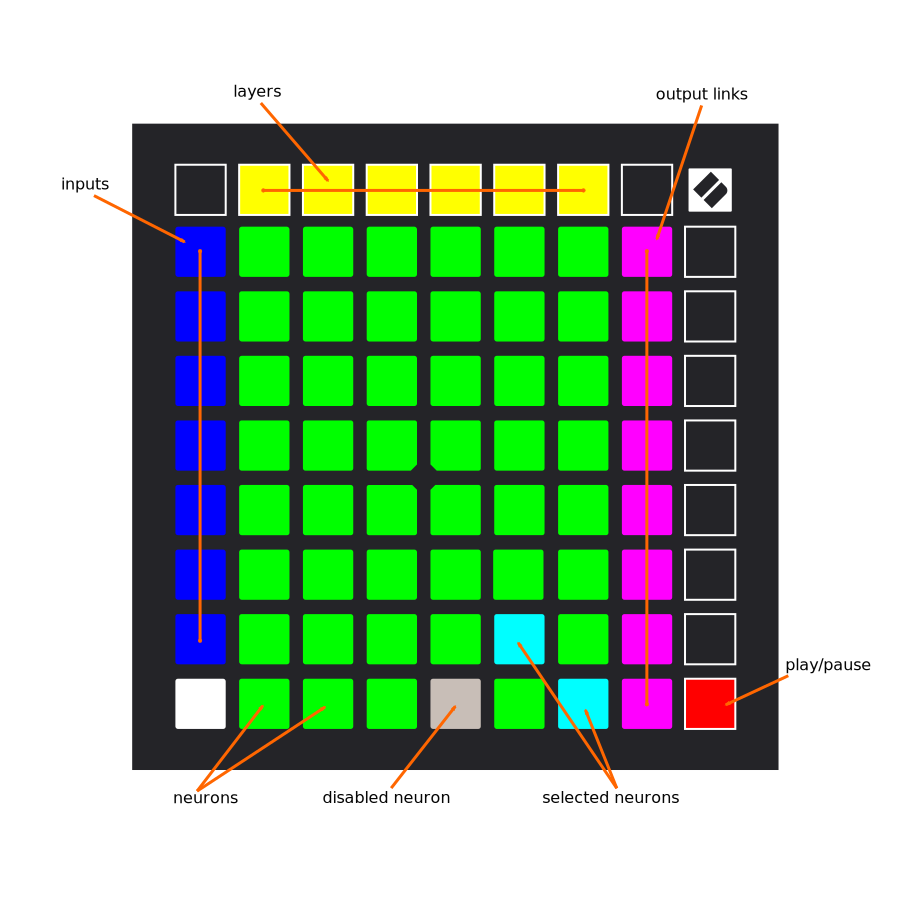

# CooLearning: playground

## 📖 Context

This project is based
on [tensorflow/playground](https://github.com/tensorflow/playground).

It aims to bring interactivity to the user interface with USB controllers by
using WebMIDI.

It has been authored
at [CREATIS Laboratory](https://www.creatis.insa-lyon.fr/site7/fr) (Lyon,
France).

## 🚀 Use

### 🌐 Online version

Available [here](https://coolearning.github.io/playground).

### ⚡ Offline version

- Go to [releases](https://github.com/CooLearning/playground/releases)
- Download the `coolearning-playground-v{version}.zip` asset
- Unzip the archive
- Open `index.html` with chrome

### 🔨 Development environment

Publishing and versioning is automatic upon any changes done to the `master`
branch.

```shell
git clone https://github.com/coolearning/playground.git
cd playground
yarn
yarn start
# navigate to http://localhost:5000
```

## 💫 Features

There are two main categories of devices you can attach.

### 🖱️ Selector

This device usually provides a **grid of colored backlit pads**.

Use the grid to display the inputs, neurons and output of the current neural
network.

- **Short press** action:
  - `enable/disable` inputs and output links
  - `select/unselect` neurons
  - `select/unselect` layer
- **Long press** action:
  - `enable/disable` neurons

### 🎛️ Controller

This device usually provides **faders, potentiometers and buttons**.

A controller has 3 main modes:

- **Default** mode:
  - When nothing is selected, you can bind controls to parameters through the **mappings UI**
- **Selection** mode:
  - When neurons are selected, you can change their:
    - Source weights
    - Source biases
    - Source meta (learning rate, activation, etc.)
- **Layer** mode:
  - When a layer is selected, you can change its:
    - Neurons biases
    - Neurons meta (learning rate, activation, etc.)

## 🧶 Constraints

- `chrome` only compatibility
- `selector` at least 64 pads
- `controller` at least 8 faders
- `d3` version 3 dependency
- No automatic configuration for unknown devices, you must provide a configuration file.
  - [Selector example](src/app/devices/known-devices/novation-launchpad-x.ts)
  - [Controller example](src/app/devices/known-devices/novation-launch-control-xl.ts)

## 📚 Supported Devices

### [Novation Launchpad X](https://novationmusic.com/en/launch/launchpad-x)



### [Novation Launch Control XL](https://novationmusic.com/en/launch/launch-control-xl)


